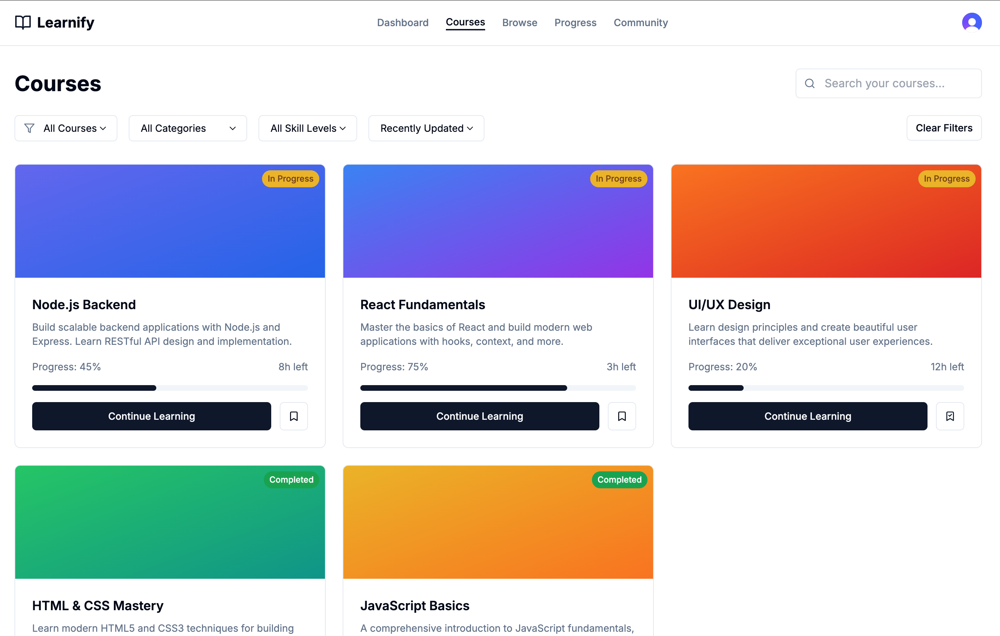

<div align="center">

# 🎓 BlockLearnX

### *Next-Generation Learning Management System*

<br/>

[](https://nextjs.org/)
[](https://www.typescriptlang.org/)
[](https://tailwindcss.com/)
[](https://clerk.com/)
[](https://prisma.io/)
[](https://vercel.com/)

<br/>

> **BlockLearnX** is a premium, full-stack Learning Management System engineered for the future of education.  
> Built on a modern web stack with enterprise-grade security, real-time progress tracking, and a vibrant community — all in one platform.

</div>

---

## 📸 Platform Showcase

### 🏠 Landing Page


> The stunning entry point to BlockLearnX — designed to captivate and convert visitors into learners instantly.

---

### 🔐 Sign-Up & Authentication


> Frictionless onboarding powered by **Clerk** — supporting email/password, Google OAuth, and two-factor authentication out of the box.

---

### 📊 User Dashboard


> Your personal command center. Track enrolled courses, monitor progress, and pick up exactly where you left off.

---

### 📚 Browse Courses


> Explore a rich catalog of courses with powerful filtering, search, and categorization to find exactly what you need.

---

### 👥 Community Hub


> Connect, collaborate, and grow with fellow learners through discussions, Q&A threads, and shared resources.

---

### 🎯 Course Detail



> Dive deep into each course — full curriculum breakdowns, instructor info, and one-click enrollment.

---

### 📈 Progress Tracker


> Visualize your learning journey with beautiful analytics, completion metrics, and milestone tracking.

---

## ✨ Features

### 🔐 Authentication & Security

| Feature | Description |
|---------|-------------|
| 📧 Email / Password Login | Secure credential-based sign-in with industry-standard hashing |
| 🔵 Google OAuth | One-click login via Google accounts |
| 🔑 Password Reset | Secure email-based password recovery flow |
| 📱 Session Management | Track and control active sessions across all devices |
| 🛡️ Two-Factor Authentication | TOTP-based 2FA for enhanced account protection |
| 🔒 Protected Routes | Middleware guards ensuring only authenticated users access sensitive content |
| 👁️ IP & Device Tracking | Monitor login activity and detect suspicious behavior |
| 🧱 Content Security Policies | Headers and policies preventing XSS and injection attacks |

---

### 📊 Dashboard & Analytics

| Feature | Description |
|---------|-------------|
| 🎓 Course Overview | Instant snapshot of all enrolled courses and their states |
| 📈 Progress Tracking | Real-time visual indicators for chapter and course completion |
| ⚡ Quick Resume | Jump back into your last active lesson with a single click |
| 🏆 Achievement Milestones | Celebrate completions with milestone-based achievements |

---

### 📚 Course Management

| Feature | Description |
|---------|-------------|
| 🗂️ Course Catalog | Browse and filter a growing library of courses |
| 📄 Dynamic Course Pages | Rich course pages with detailed curriculum and objectives |
| 🛤️ Learning Paths | Guided sequences designed for structured skill building |
| 🔔 Enrollment System | Seamless course enrollment with instant access |

---

### 👥 Community Features

| Feature | Description |
|---------|-------------|
| 💬 Discussion Forums | Topic-based forums to engage with the learner community |
| ❓ Q&A Threads | Ask questions and get answers from peers and instructors |
| 📎 Resource Sharing | Upload and share learning materials with the community |

---

## 🛠️ Tech Stack

```
BlockLearnX
├── Frontend
│   ├── Next.js 14          — App Router, SSR, file-based routing
│   ├── TypeScript 5        — Full type safety across the codebase
│   ├── Tailwind CSS 3.4    — Utility-first styling framework
│   ├── shadcn/ui           — Radix UI-powered accessible component library
│   └── Lucide React        — Beautiful, consistent icon system
│
├── Authentication
│   └── Clerk               — Auth, sessions, 2FA, OAuth out of the box
│
├── Database
│   └── Prisma ORM          — Type-safe database client with migrations
│
├── Deployment
│   ├── Vercel              — Edge-optimized hosting for Next.js
│   ├── GitHub Actions      — CI/CD pipelines via .github workflows
│   └── Serverless Fns      — Backend logic as scalable serverless functions
│
└── Developer Tooling
    ├── ESLint              — Code quality and security linting
    ├── PostCSS             — CSS transformation pipeline
    └── tsx                 — Fast TypeScript execution for scripts & seeding
```

---

## 🚀 Getting Started

### Prerequisites

- **Node.js** `>= 18.0.0`
- **npm** `>= 9.0.0`
- A **Clerk** account for authentication keys → [clerk.com](https://clerk.com)

---

### 1. Clone the Repository

```bash
git clone https://github.com/your-org/BlockLearnX.git
cd BlockLearnX
```

---

### 2. Install Dependencies

```bash
npm install
```

---

### 3. Configure Environment Variables

Copy the example environment file and fill in your credentials:

```bash
cp .env.example .env.local
```

Open `.env.local` and update the following keys:

```env
# Clerk Authentication
NEXT_PUBLIC_CLERK_PUBLISHABLE_KEY=your_clerk_publishable_key
CLERK_SECRET_KEY=your_clerk_secret_key

# Clerk Redirect URLs
NEXT_PUBLIC_CLERK_SIGN_IN_URL=/sign-in
NEXT_PUBLIC_CLERK_SIGN_UP_URL=/sign-up
NEXT_PUBLIC_CLERK_AFTER_SIGN_IN_URL=/dashboard
NEXT_PUBLIC_CLERK_AFTER_SIGN_UP_URL=/dashboard

# Database (Prisma)
DATABASE_URL=your_database_connection_string
```

---

### 4. Set Up the Database

```bash
# Run migrations
npx prisma migrate dev

# (Optional) Seed the database
npm run prisma:seed
```

---

### 5. Start the Development Server

```bash
npm run dev
```

The application will be live at **[http://localhost:3000](http://localhost:3000)** 🎉

---

## 📦 Available Scripts

| Script | Description |
|--------|-------------|
| `npm run dev` | Start the development server with hot-reload |
| `npm run build` | Build the production-ready bundle |
| `npm run start` | Serve the production build locally |
| `npm run lint` | Run ESLint for code quality checks |
| `npm run lint:security` | Run security-focused ESLint rules |
| `npm run audit` | Audit npm dependencies for vulnerabilities |
| `npm run audit:fix` | Automatically fix audited vulnerabilities |
| `npm run security:check` | Run full security audit + lint pass |
| `npm run type-check` | TypeScript type-checking without emitting files |

---

## 🌐 Deployment

BlockLearnX is deployed on **Vercel** — the platform built for Next.js.

### Deployment Highlights

- ✅ **Automatic Deployments** — Every push to `main` triggers a fresh deployment
- ✅ **Serverless Functions** — API routes run as scalable serverless functions
- ✅ **Free SSL** — HTTPS enabled by default on all deployments
- ✅ **Global CDN** — Assets served from the edge for blazing-fast load times
- ✅ **Preview Deployments** — Every PR gets its own preview URL for testing


---

## 📁 Project Structure

```
BlockLearnX/
├── app/
│   ├── (auth)/             # Sign-in, sign-up, and auth-related pages
│   ├── (dashboard)/        # Protected dashboard routes
│   │   └── (routes)/
│   │       ├── browse/     # Course catalog
│   │       ├── community/  # Community hub
│   │       ├── courses/    # Course detail pages
│   │       ├── dashboard/  # User dashboard
│   │       └── progress/   # Progress tracking
│   ├── globals.css         # Global styles
│   ├── layout.tsx          # Root application layout
│   └── page.tsx            # Landing page
├── components/
│   └── ui/                 # shadcn/ui components (Button, Card, Dialog, etc.)
├── lib/                    # Utility functions and shared logic
├── prisma/                 # Prisma schema, migrations, and seed scripts
├── public/                 # Static assets served at root
├── assets/
│   └── images/             # Screenshots and marketing assets
├── scripts/                # One-off utility scripts
├── middleware.ts            # Next.js middleware for auth route protection
├── next.config.mjs         # Next.js configuration
├── tailwind.config.ts      # Tailwind CSS configuration
└── tsconfig.json           # TypeScript configuration
```

---

## 🤝 Contributing

We welcome contributions to BlockLearnX! Here's how to get started:

1. **Fork** the repository
2. **Create** a feature branch: `git checkout -b feature/your-feature-name`
3. **Commit** your changes: `git commit -m 'feat: add your feature'`
4. **Push** to your branch: `git push origin feature/your-feature-name`
5. **Open** a Pull Request and describe your changes

Please follow our coding standards:

- Run `npm run lint` before committing
- Run `npm run type-check` to ensure type safety
- Run `npm run security:check` to pass security validations

---

## 📄 License

This project is licensed under the **MIT License**.  
See the [LICENSE](LICENSE) file for full details.

---

## ⚠️ Disclaimer

BlockLearnX is provided **"as is"** without warranty of any kind, express or implied.  
The authors and contributors are not responsible for any issues, damages, or liabilities arising from the use of this software. Use at your own risk.

---

<div align="center">

**Built with ❤️ by the BlockLearnX Team**

[](https://nextjs.org)
[](https://vercel.com)
[](https://clerk.com)

</div>
